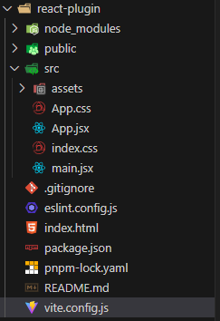

> 本示例使用vite+react作说明

## 1. 创建项目

使用vite创建react示例项目

```bash
# 若是npm 7+，需要添加额外的 --，使用下面命令：
$ npm create vite@latest react-plugin -- --template react

# 若是yarn，使用下面命令
yarn create vite react-plugin --template react

# 若是pnpm，使用下面命令
pnpm create vite react-plugin --template react

```

安装依赖

```bash
# 进入项目目录
cd react-plugin
```

```bash
# 若是npm，使用下面命令
npm i

# 若是yarn，使用下面命令
yarn

# 若是pnpm，使用下面命令
pnpm i
```

## 2. 接入改造

本案例是一个比较简单的例子, 若想快速完成一个插件项目, 可略过以下的**具体改造指南**, copy下文贴出的文件内容（即vite.config.js、main.jsx、App.jsx）， 并安装vite-plugin-mkcert、freelog-runtime两个库，即可快速完成项目哦;

**具体改造指南：**

* [vite框架改造，看这里](../framework/vite)
* [react框架改造，看这里](../framework/react)
* [https，看这里](./index/#开发指南): 让网站可以使用https访问

目前，你的文件目录如下图所示



启动项目，你的网站应该可以使用https访问，如 https://localhost:8809

```bash
# 若你是npm，使用下面命令
npm run dev

# 若是yarn，使用下面命令
yarn run dev

# 若是pnpm，使用下面命令
pnpm dev
```

vite.config.js文件内容如下:

```js
import { defineConfig } from 'vite'
import react from '@vitejs/plugin-react'
import mkcert from "vite-plugin-mkcert";

// https://vite.dev/config/
export default defineConfig({
  plugins: [mkcert(), react()],
  server: {
    port: 8809,
    host: true,
    headers: {
      "Access-Control-Allow-Origin": "*"
    }
  },
})

```

## 3. 开始开发

### 3.1 安装API库与初始化

[安装API库与初始化，看这里](./index/#开发指南)

```js
// main.jsx文件内容如下
import { StrictMode } from 'react'
import { createRoot } from 'react-dom/client'
import './index.css'
import App from './App.jsx'
import { initFreelogApp } from 'freelog-runtime'

const root = createRoot(document.getElementById('root'))

window.mount = () => {
  initFreelogApp()
  root.render(
    <StrictMode>
      <App />
    </StrictMode>,
  )
}

window.unmount = () => {
  root.unmount();
}

if (!window.__MICRO_APP_ENVIRONMENT__) {
  window.mount();
}
```

### 3.2 使用静态数据渲染列表

`App.jsx`的文件内容如下：

```js
import './App.css'

function App() {

  return (
    <>
      <p>我是一个react插件项目</p>
    </>
  )
}

export default App
```

本地开发时（指直接访问https://localhost:8809）, 效果图如下所示：


## 4. 打包压缩并上传发布

打包

```bash
# 若是npm, 执行下面命令
npm run build

# 若是yarn, 执行下面命令
yarn run build

# 若是pnpm, 执行下面命令
pnpm build

```

进入打包产物文件夹, 如dist，选择所有文件，压缩成一个压缩包，如dist.zip进入打包产物文件夹, 如dist，选择所有文件，压缩成一个压缩包，如dist.zip

[step1: 发布, 查看这里](./release)

[step2: 发布成功后， 查看这里如何进行本地开发调试](./use-plugin-react)
