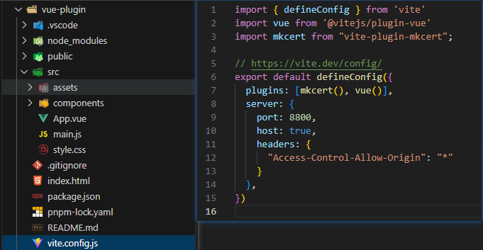
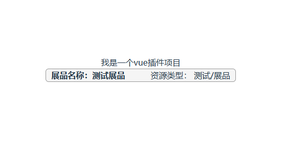

> 本示例使用vite+vue3作说明

## 1. 创建项目

使用vite创建vue3示例项目

```bash
# 若是npm 7+，需要添加额外的 --，使用下面命令：
$ npm create vite@latest vue-plugin -- --template vue

# 若是yarn，使用下面命令
yarn create vite vue-plugin --template vue

# 若是pnpm，使用下面命令
pnpm create vite vue-plugin --template vue

```

安装依赖

```bash
# 进入项目目录
cd vue-plugin
```

```bash
# 若是npm，使用下面命令
npm i

# 若是yarn，使用下面命令
yarn

# 若是pnpm，使用下面命令
pnpm i
```

## 2. 接入改造

本案例是一个比较简单的例子, 若想快速完成一个插件项目, 可略过以下的**具体改造指南**, copy下文贴出的文件内容（即vite.config.js、main.js、App.vue、HelloWorld.vue）， 并安装vite-plugin-mkcert、freelog-runtime两个库，即可快速完成项目哦;

**具体改造指南：**

* [vite框架改造，看这里](../framework/vite)
* [vue3框架改造，看这里](../framework/vue)
* [https，看这里](./index/#开发指南): 让网站可以使用https访问

目前，你的文件目录如下图所示



启动项目，你的网站应该可以使用https访问，如 https://localhost:8800

```bash
# 若你是npm，使用下面命令
npm run dev

# 若是yarn，使用下面命令
yarn run dev

# 若是pnpm，使用下面命令
pnpm dev
```

vite.config.js

```js
import { defineConfig } from 'vite'
import vue from '@vitejs/plugin-vue'
import mkcert from "vite-plugin-mkcert";

// https://vite.dev/config/
export default defineConfig({
  plugins: [mkcert(), vue()],
  server: {
    port: 8800,
    host: true,
    headers: {
      "Access-Control-Allow-Origin": "*"
    }
  },
})
```

## 3. 开始开发

### 3.1 安装API库与初始化

[安装API库与初始化，看这里](./index/#开发指南)

```js
// main.js文件内容如下
import { createApp } from 'vue'
import './style.css'
import App from './App.vue'
import { initFreelogApp } from 'freelog-runtime'

const appInstance = createApp(App)

window.mount = () => {
  initFreelogApp()
  appInstance.mount('#app')
}

window.unmount = () => {
  app.unmount()
}

if (!window.__MICRO_APP_ENVIRONMENT__) {
  window.mount();
}
```

### 3.2 使用静态数据渲染列表

`HelloWorld.vue`的文件内容如下：

```js
<script setup>
import { ref } from 'vue'

const list = ref([])

list.value = [
  {
    exhibitName: '测试展品',
    articleInfo: {
      resourceType: ['测试', '展品']
    }
  }
] 

const handlerClick = (item) => {
  alert(item.exhibitName)
}

</script>

<template>
  <ul>
    <li v-for="item in list" @click="handlerClick(item)">
      <div class="r-name">展品名称：{{ item.exhibitName }}</div>
      <div class="r-type">资源类型： {{ item.articleInfo.resourceType.join('/') }}</div>
    </li>
  </ul>
</template>

<style scoped>
ul {
  padding: 0;
  margin: 0;

  li {
    padding: 0;
    margin: 0;
    list-style: none;
    list-style-type: none;
    margin-bottom: 15px;
    background-color: #f5f5f5;
    border: 1px solid #989898;
    border-radius: 6px;
    padding: 0 10px;
    display: flex;

    .r-name {
      margin-right: 50px;
      font-weight: 600;
    }
  }
}
</style>


```

App.vue的文件内容如下

```js
<script setup>
import HelloWorld from './components/HelloWorld.vue'

</script>

<template>
  <div>
    我是一个vue插件项目
  </div>
  <HelloWorld msg="Vite + Vue" />
</template>

<style scoped>
.logo {
  height: 6em;
  padding: 1.5em;
  will-change: filter;
  transition: filter 300ms;
}
.logo:hover {
  filter: drop-shadow(0 0 2em #646cffaa);
}
.logo.vue:hover {
  filter: drop-shadow(0 0 2em #42b883aa);
}
</style>
```

本地开发时（指直接访问https://localhost:8800）, 效果图如下所示：



## 4. 打包压缩并上传发布

打包

```bash
# 若是npm, 执行下面命令
npm run build

# 若是yarn, 执行下面命令
yarn run build

# 若是pnpm, 执行下面命令
pnpm build

```

进入打包产物文件夹, 如dist，选择所有文件，压缩成一个压缩包，如dist.zip进入打包产物文件夹, 如dist，选择所有文件，压缩成一个压缩包，如dist.zip

[step1: 发布, 查看这里](./release)

[step2: 发布成功后， 查看这里如何进行本地开发调试](./use-plugin-vue)
