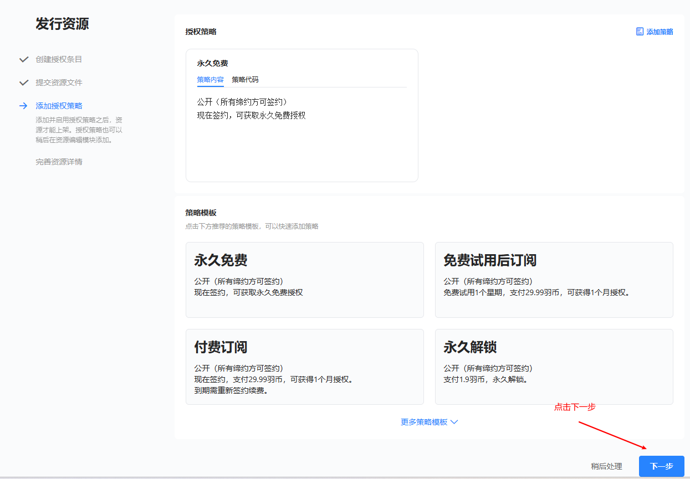

下面将说明如何在freelog平台上发布一个主题/插件；

## 1. 登录/注册

[测试服点这里](https://user.testfreelog.com/login) [正式服点这里](https://user.freelog.com/login)

登录后，点击页面右上角，头像旁边的“进入工作台”

## 2. 创建资源

点击页面右上角，头像旁边的“+”弹出下拉，选择“创建资源”

点击“发行单个资源”

资源类型选择时, 若发的是“主题”包则下拉选择主题, 若发的是"插件" 包下拉则选择插件，并输入“资源标题”及“资源授权标识”

## 3. 打包并上传资源

将打包的web应用资源（html、js、css）压缩为.zip格式并上传；确保解压后不是一个文件夹，解压后html文件应在根目录中；

选择压缩包文件前上传，若是vite项目，还需要点击“补充属性”并输入键为bundleTool, 值为vite, 完成后点击“提交”

### 3.1 上传zip压缩包

### 3.2 若为vite创建项目，还需"补充属性"

> **注意：若是vite项目，还需要点击“补充属性”并输入键为bundleTool, 值为vite；**

### 3.3 提交

## 4. 发布

### 4.1 添加授权策略

> 所谓策略，通俗的理解就是一种收费方法；

点击弹框右上角的 “校验”

再点击弹框右上角的“创建”

点击“下一步”

### 4.2 上架

点击“现在上架”

到这里，在“我的资源”中可以看到我们刚上架完成的主题；
