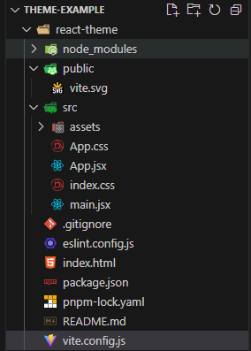
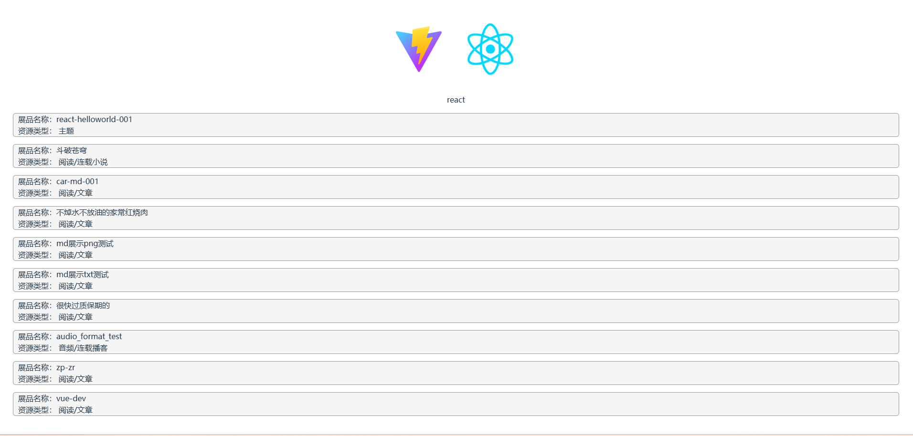

> 本示例使用vite+react作说明

## 1. 创建项目

使用vite创建react示例项目

```bash
# 若是npm 7+，需要添加额外的 --，使用下面命令：
$ npm create vite@latest react-theme --template react

# 若是yarn，使用下面命令
yarn create vite react-theme --template react

# 若是pnpm, 使用下面命令
pnpm create vite react-theme --template react
```

安装依赖

```bash
# 进入项目目录
cd react-theme
```

```bash
# 若是npm，使用下面命令
npm i

# 若是yarn，使用下面命令
yarn

# 若是pnpm，使用下面命令
pnpm i
```

## 2. 接入改造

本案例是一个比较简单的例子, 若想快速完成一个插件项目, 可略过以下的**具体改造指南**, copy下文贴出的文件内容（即vite.config.js、main.js、App.jsx、App.css）， 并安装vite-plugin-mkcert、freelog-runtime两个库，即可快速完成项目哦;

**具体改造指南：**

* [vite框架改造，看这里](../framework/vite)
* [react框架改造，看这里](../framework/react)
* [https，看这里](./index/#开发指南): 让网站可以使用https访问

目前，你的文件目录如下图所示



vite.config.js文件内容如下:

```js
// vite.config.js
import { defineConfig } from 'vite'
import react from '@vitejs/plugin-react'
import mkcert from "vite-plugin-mkcert";

// https://vite.dev/config/
export default defineConfig({
  plugins: [mkcert(), react()],
  server: {
    port: 8990,
    host: true,
    headers: {
      "Access-Control-Allow-Origin": "*"
    }
  },
})
```

启动项目，你的网站应该可以使用https访问，如 https://localhost:8990/

```
# 若你是npm，使用下面命令
npm run dev

# 若是yarn，使用下面命令
yarn run dev

# 若是pnpm，使用下面命令
pnpm dev
```


## 3. 开始开发

### 3.1 安装API库与初始化

[安装API库与初始化，看这里](./index/#开发指南)

```js
// main.jsx文件内容如下
import { StrictMode } from 'react'
import { createRoot } from 'react-dom/client'
import './index.css'
import App from './App.jsx'
import { initFreelogApp } from 'freelog-runtime'

const root = createRoot(document.getElementById('root'))

window.mount = () => {
  initFreelogApp()
  root.render(
    <StrictMode>
      <App />
    </StrictMode>,
  )
}

window.unmount = () => {
  root.unmount();
}

if (!window.__MICRO_APP_ENVIRONMENT__) {
  window.mount();
}

```

## 4. 打包压缩并上传发布

打包

```bash
# 若是npm, 执行下面命令
npm run build

# 若是yarn, 执行下面命令
yarn run build

# 若是pnpm, 执行下面命令
pnpm build
```

进入打包产物文件夹, 如dist，选择所有文件，压缩成一个压缩包，如dist.zip

[step1: 发布, 查看这里](./release)

[step2: 签约主题到节点；查看这里](./use-theme#如何签约主题到节点)

[step3: 启用主题；查看这里](./use-theme#如何启用主题)

> Q1： 为什么要将主题签约到节点？
>
> A1： 所谓节点，其实是一个网站地址。主题可类比为网站的衣服，节点可签约多个主题拥有多件不同的衣服，但只能应用一个主题，启用某个主题后， 会发现网站用的就是这个主题作为外观；一句话总结，签约是为了让节点可使用主题作为外观；

## 5. 项目调试

访问你的节点地址，如 https://acarlikecar.testfreelog.com，现在可确认刚启用的主题是否已生效

### 5.1 本地调试

使用url传参的形式进行调试，在节点地址后加上`?dev=https://localhost:8990`进行调试；

### 5.2 使用API

使用`getExhibitListByPaging`获取数据并渲染了一个资源列表，`App.jsx`的文件内容如下：

```js
import { useState, useEffect } from 'react'
import reactLogo from './assets/react.svg'
import viteLogo from '/vite.svg'
import './App.css'
import { freelogApp } from 'freelog-runtime'
function App() {
  const [list, setList] = useState([])

  const handlerClick = (item) => {
    alert(item.exhibitName)
  }

  useEffect(() => {
    freelogApp.getExhibitListByPaging().then(res => {
      if (res.data.errCode === 0) {
        setList(res.data.data.dataList)
      }
    })
  }, [])

  return (
    <>
      <div>
        <a href="https://vite.dev" target="_blank">
          
        </a>
        <a href="https://react.dev" target="_blank">
          
        </a>
      </div>
      <ul>

      { list.map(item => (
          <li onClick={ () => handlerClick(item) } key={item.exhibitId}>
            <div className={'r-name'}>展品名称：{ item.exhibitName }</div>
            <div className={'r-type'}>资源类型： { item.articleInfo.resourceType.join('/') }</div>
          </li>
        )) 
      }
      </ul>
    </>
  )
}

export default App
```

App.css文件内容如下:

根元素高为一屏, 超过则滚动

```scss
#root {
  margin: 0 auto;
  text-align: center;
  width: 100%;
  height: 100vh;
  overflow: auto;
  padding: 2rem;
}

.logo {
  height: 6em;
  padding: 1.5em;
  will-change: filter;
  transition: filter 300ms;
}
.logo:hover {
  filter: drop-shadow(0 0 2em #646cffaa);
}
.logo.react:hover {
  filter: drop-shadow(0 0 2em #61dafbaa);
}

@keyframes logo-spin {
  from {
    transform: rotate(0deg);
  }
  to {
    transform: rotate(360deg);
  }
}

@media (prefers-reduced-motion: no-preference) {
  a:nth-of-type(2) .logo {
    animation: logo-spin infinite 20s linear;
  }
}

.card {
  padding: 2em;
}

.read-the-docs {
  color: #888;
}

ul {
  padding: 0;
  margin: 0;

  li {
    padding: 0;
    margin: 0;
    list-style: none;
    list-style-type: none;
    margin-bottom: 15px;
    background-color: #f5f5f5;
    border: 1px solid #989898;
    border-radius: 6px;
    padding: 0 10px;
    div {
      text-align: left;
    }
  }
}
```

效果图如下所示：



开发完成后，再次发布/发行即可，若发行后访问节点发现未生效，则需手动切换一次版本再尝试访问节点（[不知如何切换？查看这里](./use-theme.html#如何切换主题版本)）；
