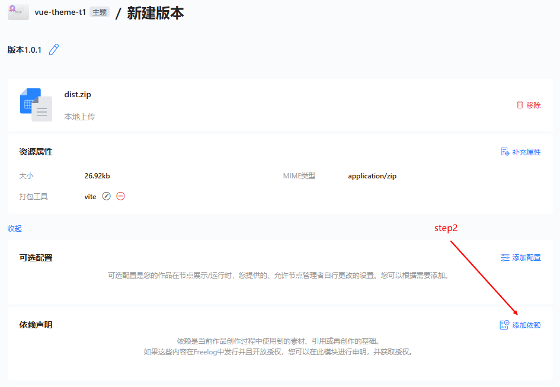

## 如何签约主题到节点？

主题开发者，在主题发布后，可在"我的资源"中找到想要的主题，点击"资源详情"进入

然后按步骤完成签约流程；

## 如何启用主题？

然后按步骤完成启用流程；

## 如何切换主题版本？

## 如何更新主题项目？

进入 "新建版本" 页

### step1: 移除

### step2: 上传文件

## 如何将插件添加为主题项目的依赖？

### step1: 点击”更多设置“按钮

### step2: 点击”添加依赖“按钮

### step3: 点选插件项目

### step4: 点击”签约“按钮

### step5: 点击”提交“按钮

### step6: 点击”发行“按钮

