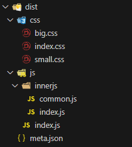

制作库的几个关键点

## 1.配置打包工具

* 配置命名空间;(即此库存到window的哪个属性下, 获取库时只能使用api获取, [点此查看api](./library-usage))
* 配置打包格式为umd;(不支持esm格式)


### 1.1 rollup配置示例

```js
// rollup.config.mjs
export default {
	input: 'src/main.js', // 库的入口文件
	output: {
		file: 'dist/index.freelog-library.umd.js',
		format: 'umd', // 配置为umd的打包格式
		name: 'freelogLibrary.Freelog.localModule', // 配置命名空间
	}
};

```

### 1.2 vite配置示例

vite会自动打包umd和esm两种格式, 所以这里不需要配置打包格式为umd; 打完包后, 可选择删去esm格式的文件;

```js
// vite.config.js
import { defineConfig } from 'vite'
import path from 'path'

export default defineConfig({
  build: {
    lib: {
      entry: path.resolve(__dirname, 'src/index.ts'), // 入口文件
      name: 'freelogLibrary.Freelog.Kittle', // 配置命名空间
      fileName: (format) => `index.freelog-library.${format}.js`,
    },
  }
})

```

### 1.3 webpack5配置示例

```js
// webpack.config.js
const path = require('path');

const isProduction = process.env.NODE_ENV == 'production';

const config = {
  entry: './src/index.js', // 入口文件
  output: {
    path: path.resolve(__dirname, 'dist'),
    library: 'freelogLibrary.Freelog.moduleTest', // 命名空间
    libraryTarget: 'umd' // 打包格式
  }
};

module.exports = () => {
  if (isProduction) {
    config.mode = 'production';
  } else {
    config.mode = 'development';
  }
  return config;
};
```

## 2.用meta.json描述打包产物的文件系统

* meta.json必须在根目录;
* meta.json的nameSpace与"配置打包工具"的"1. 配置命名空间"的命名空间一致;
* meta.json的字段是固定的, 不能随意修改;

下面是几个打包后的文件结构示例, 以及其对应的meta.json示例, 帮助理解如何写meta.json;

### 2.1 示例1

当你的代码打包的文件目录如下所示时


其对应的meta.json如下

```json
{
  "nameSpace": "freelogLibrary.Freelog.localModule",
  "js": {
    "entry": "index.js",
    "other": []
  },
  "css": {
    "entry": "index.css",
    "other": []
  },
  "other": [
    "meta.json"
  ]
}
```

### 2.2 示例2

当你的代码打包的文件目录如下所示时



其对应的meta.json如下

```json
{
  "nameSpace": "freelogLibrary.Freelog.localModule",
  "js": {
    "entry": "js/index.js",
    "other": [
      "js/innerjs/common.js",
      "js/innerjs/index.js"
    ]
  },
  "css": {
    "entry": "css/index.css",
    "other": [
      "css/big.css",
      "css/small.css"
    ]
  },
  "other": [
    "meta.json"
  ]
}
```

## 3.压缩打包并发布

### 3.1 打压缩包

进入打包后产物的文件夹根目录, 如dist, 选中所有文件并压缩成一个.zip文件, 如asset.zip;

### 3.2 发布库

打开平台, 注册并登录账号, 开始发布资源: [测试服点这里](https://console.testfreelog.com), [正式服点这里](https://console.freelog.com/), 关键步骤如下:

- step1: 点击右上角按钮"进入工作台"
- step2: 点击右上角的按钮"+"并选择下拉选项"创建资源"
- step3: 点击"发行单个资源"


- step4: 选择"软件库"资源类型


* step5: 创建


> 注意, 暂时建议, 资源标题与资源标识使用相同的名称, 因为现在市场没有地址可直接获取资源标识;

- step6: 上传我们写的helloworld库的压缩包


- step...

走完此流程后, 在"资源管理"页面可看到刚创建的库资源, 当资源是"已上架"的状态时(如下图), 其他人则可以检索并看到你发布的资源, 至此, 库就成功发布到了线上, 处于他人可用的状态下了;


