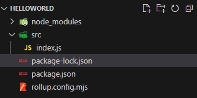

> 环境要求: 若你还未安装node, 则需要先行安装node;

下面我们会创建并发布一个简单的库, 此库提供一个sayHello函数, 调用此函数, 会在控制台打印"Hello World! beta2"

```js
function sayHello() {
  console.log("Hello World! beta2");
}
```

## 创建项目

根目录下创建一个文件夹, 并命名一个项目名称, 如 helloworld

进入文件根目录中,  并创建package.json文件

```bash
# 执行命令创建package.json
npm init
```

## 写代码

创建src文件夹, 并创建index.js文件

```js
function sayHello() {
  console.log("Hello World! beta2");
}

export { sayHello }
```

## 使用打包工具

使用打包工具对代码进行打包, 这里使用rollup作为打包工具(当然你也可以使用其他的打包工具)

安装打包工具rollup

```js
npm i rollup -D
```

根目录创建文件rollup.config.mjs

`output.name`字段的命令规则为: `freelogLibrary.${您在freelog平台的用户名}.${自定义的英文名字}`

```js
export default {
	input: 'src/index.js',
	output: {
		file: 'dist/index.freelog-library.umd.js',
		format: 'umd',
		name: 'freelogLibrary.Freelog.localModule',
	}
};
```

目前, 项目结构如下图



## 开始打包

文件根目录中打开package.json文件, 修改script字段, 修改后如下

```json
"scripts": {
   "build": "rollup -c"
 }
```

执行命令打包

```bash
npm run build
```

## meta.json

用meta.json文件描述打包产物的文件系统

进入打包后的文件夹dist, 并新建meta.json文件, json数据结构如下

```js
{
  "nameSpace": "freelogLibrary.Freelog.localModule", // 同rollup.config.mjs中的output.name(必须提供)
  "js": {
    "entry": "index.freelog-library.umd.js", // js入口文件路径; 若入口文件在文件夹js里, 则entry应为 js/filename.js(必须提供)
    "other": [] // 其他的js文件路径(有则提供, 无则为[])
  },
  "css": {
    "entry": "", // css入口文件路径, 若你的库有css入口文件的就填写, 此示例不用填写;(有则提供, 无则为"")
    "other": [] // 其他的css文件路径(有则提供, 无则为[])
  },
  "other": [
    "meta.json"
  ] // 其他的文件路径(有则提供, 无则为[])
}
```

至此, 你的项目结构如下图:


## 压缩打包并发布

[查看如何发布库](./guide#_3-压缩打包并发布)
