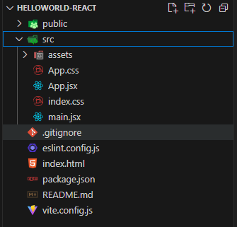
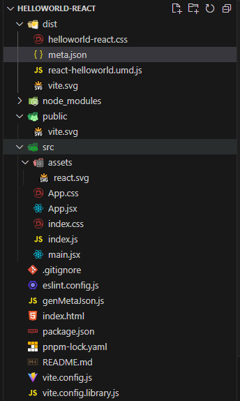

下面我们使用vite创建一个helloworld的react组件库;

## 创建项目

目前, 项目结构如下:



> 环境要求: vite6.x版本要求node18.x版本以上

进入项目根目录, 安装依赖

```bash
# 若你是npm, 则 npm i; 若你是yarn, 则 yarn
pnpm i
```

## 写代码

将App.css文件内容替换成如下

```css
#root {
  max-width: 1280px;
  margin: 0 auto;
  padding: 2rem;
  text-align: center;
}

.logo {
  height: 6em;
  padding: 1.5em;
  will-change: filter;
  transition: filter 300ms;
}
.logo:hover {
  filter: drop-shadow(0 0 2em #646cffaa);
}
.logo.react:hover {
  filter: drop-shadow(0 0 2em #61dafbaa);
}

@keyframes logo-spin {
  from {
    transform: rotate(0deg);
  }
  to {
    transform: rotate(360deg);
  }
}

@media (prefers-reduced-motion: no-preference) {
  a:nth-of-type(2) .logo {
    animation: logo-spin infinite 20s linear;
  }
}

.card {
  padding: 2em;
}

.read-the-docs {
  color: #888;
}


a {
  font-weight: 500;
  color: #646cff;
  text-decoration: inherit;
}
a:hover {
  color: #535bf2;
}

h1 {
  font-size: 3.2em;
  line-height: 1.1;
}

button {
  border-radius: 8px;
  border: 1px solid transparent;
  padding: 0.6em 1.2em;
  font-size: 1em;
  font-weight: 500;
  font-family: inherit;
  background-color: #36d399;
  cursor: pointer;
  transition: border-color 0.25s;
}
button:hover {
  border-color: #646cff;
}
button:focus,
button:focus-visible {
  outline: 4px auto -webkit-focus-ring-color;
}
```

将index.css文件内容替换成如下

```css
:root {
  font-family: Inter, system-ui, Avenir, Helvetica, Arial, sans-serif;
  line-height: 1.5;
  font-weight: 400;

  color-scheme: light dark;
  color: rgba(255, 255, 255, 0.87);
  background-color: #242424;

  font-synthesis: none;
  text-rendering: optimizeLegibility;
  -webkit-font-smoothing: antialiased;
  -moz-osx-font-smoothing: grayscale;
}

@media (prefers-color-scheme: light) {
  :root {
    color: #213547;
    background-color: #ffffff;
  }
  a:hover {
    color: #747bff;
  }
  button {
    background-color: #f9f9f9;
  }
}

```

在src文件夹下新建index.js

```js
import HelloWorld from './App.jsx'

export default HelloWorld

export { HelloWorld }
```

## 修改配置

根目录上新建vite.config.library.js

```js
import { defineConfig } from 'vite'
import react from '@vitejs/plugin-react'

// https://vite.dev/config/
export default defineConfig({
  build: {
    lib: {
      entry: 'src/index.js',
      name: 'freelogLibrary.Freelog.reactHelloworld',
      fileName: (format) => `react-helloworld.${format}.js`,
      formats: ['umd'],
    },
  },
  external: ['react', 'react-dom'],
  plugins: [react()],
})

```

## 开始打包

修改package.json的scripts字段

```json
"scripts": {
  "dev": "vite --port 3000",
  "build": "vite build",
  "lint": "eslint .",
  "preview": "vite preview",
  "build:lib": "vite build -c vite.config.library.js"
}
```

执行打包命令

```bash
pnpm build:lib
```

至此, 项目结构如下:



## meta.json

```json
{
  "nameSpace": "freelogLibrary.Freelog.reactHelloworld",
  "js": {
    "entry": "react-helloworld.umd.js",
    "other": []
  },
  "css": {
    "entry": "helloworld-react.css",
    "other": []
  },
  "other": [
    "vite.svg",
    "meta.json"
  ]
}
```


## 压缩打包并发布

[查看如何发布库](./guide#_3-压缩打包并发布)
