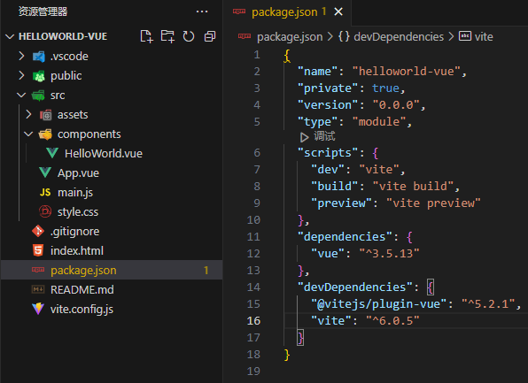
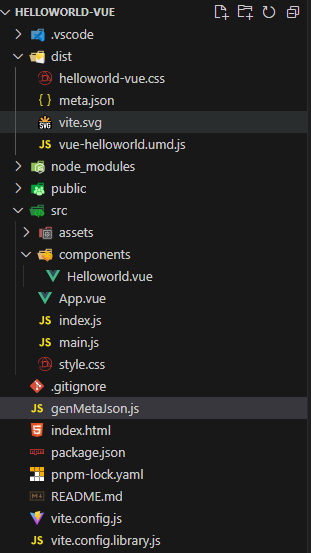

下面我们使用vite创建一个helloworld的vue组件库;

## 创建项目

```bash
# npm 7+，需要添加额外的 --：
npm create vite@latest helloworld-vue -- --template vue
```

目前, 项目结构如下:



> 环境要求: vite6.x版本要求node18.x版本以上

进入项目根目录, 安装依赖

```bash
# 若你是npm, 则 npm i; 若你是yarn, 则 yarn
pnpm i
```

## 写代码

将Helloworld.vue文件内容替换成如下

```js
<script setup>
import { ref } from 'vue'

defineProps({
  msg: String,
})

const count = ref(0)
</script>

<template>
  <h1>{{ msg }}</h1>

  <div class="card">
    <button type="button" @click="count++">count is {{ count }}</button>
    <p>
      Edit
      <code>components/HelloWorld.vue</code> to test HMR
    </p>
  </div>

  <p>
    Check out
    <a href="https://vuejs.org/guide/quick-start.html#local" target="_blank"
      >create-vue</a
    >, the official Vue + Vite starter
  </p>
  <p>
    Learn more about IDE Support for Vue in the
    <a
      href="https://vuejs.org/guide/scaling-up/tooling.html#ide-support"
      target="_blank"
      >Vue Docs Scaling up Guide</a
    >.
  </p>
  <p class="read-the-docs">Click on the Vite and Vue logos to learn more</p>
</template>

<style scoped>
.read-the-docs {
  color: #888;
}

a {
  font-weight: 500;
  color: #646cff;
  text-decoration: inherit;
}
a:hover {
  color: #535bf2;
}

h1 {
  font-size: 3.2em;
  line-height: 1.1;
}

button {
  border-radius: 8px;
  border: 1px solid transparent;
  padding: 0.6em 1.2em;
  font-size: 1em;
  font-weight: 500;
  font-family: inherit;
  background-color: #535bf2;
  cursor: pointer;
  transition: border-color 0.25s;
}
button:hover {
  border-color: #646cff;
}
button:focus,
button:focus-visible {
  outline: 4px auto -webkit-focus-ring-color;
}

.card {
  padding: 2em;
}

</style>

```

将style.css文件内容替换成如下

```css
:root {
  font-family: Inter, system-ui, Avenir, Helvetica, Arial, sans-serif;
  line-height: 1.5;
  font-weight: 400;

  color-scheme: light dark;
  color: rgba(255, 255, 255, 0.87);
  background-color: #242424;

  font-synthesis: none;
  text-rendering: optimizeLegibility;
  -webkit-font-smoothing: antialiased;
  -moz-osx-font-smoothing: grayscale;
}

body {
  margin: 0;
  display: flex;
  place-items: center;
  min-width: 320px;
  min-height: 100vh;
}

#app {
  max-width: 1280px;
  margin: 0 auto;
  padding: 2rem;
  text-align: center;
}

@media (prefers-color-scheme: light) {
  :root {
    color: #213547;
    background-color: #ffffff;
  }
  a:hover {
    color: #747bff;
  }
  button {
    background-color: #f9f9f9;
  }
}

```

在src文件夹下新建index.js

```js
import HelloWorld from "./components/HelloWorld.vue";

export default HelloWorld

export { HelloWorld }
```

## 修改配置

根目录上新建vite.config.library.js

```js
import { defineConfig } from 'vite'
import vue from '@vitejs/plugin-vue'
import path from 'path'

// https://vite.dev/config/
export default defineConfig({
  build: {
    lib: {
      entry: path.resolve(__dirname, 'src/index.js'),
      name: 'freelogLibrary.Freelog.vueHelloworld',
      fileName: (format) => `vue-helloworld.${format}.js`,
      formats: ['umd']
    },
    rollupOptions: {
      external: ['vue'],
      output: {
        globals: {
          vue: 'Vue',
        },
        name: 'freelogLibrary.Freelog.vueHelloworld'
      },
    },
  },
  plugins: [vue()],
})

```

## 开始打包

修改package.json的scripts字段

```json
"scripts": {
  "dev": "vite --port 8889",
  "build": "vite build",
  "preview": "vite preview",
  "build:lib": "vite build -c vite.config.library.js"
},
```

执行打包命令

```bash
pnpm build:lib
```

至此, 项目结构如下:



## meta.json

进入dist文件夹中, 新建meta.json

```js
{
  "nameSpace": "freelogLibrary.Freelog.vueHelloworld",
  "js": {
    "entry": "vue-helloworld.umd.js",
    "other": []
  },
  "css": {
    "entry": "helloworld-vue.css",
    "other": []
  },
  "other": [
    "vite.svg",
    "meta.json"
  ]
}
```

## 压缩打包并发布

[查看如何发布库](./guide#_3-压缩打包并发布)
